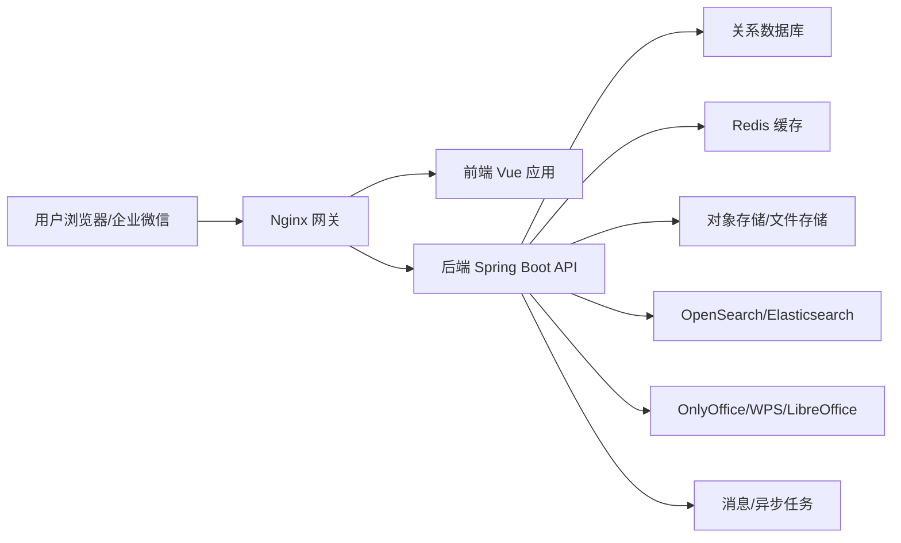

# 系统架构与技术选型

## 1. 架构总览



## 2. 主要服务职责

### 2.1 前端 Web

- 登录页。
- 工作台。
- 文档库目录树。
- 文件列表和操作菜单。
- 文件预览页。
- 权限配置页。
- 用户、部门、角色管理页。
- 消息中心。
- 系统管理页。

### 2.2 后端 API

- 用户认证与授权。
- 文件夹/文件元数据管理。
- 文件上传下载授权。
- 文件版本管理。
- 权限规则计算。
- 消息与通知。
- 审计日志。
- 搜索索引同步。
- 对外开放 API。

### 2.3 文件存储

文件内容不直接存在数据库中。数据库只保存文件元数据、版本信息和存储对象 Key。

推荐存储方式：

- 开发环境：MinIO。
- 内网生产：MinIO 或 NAS。
- 未来扩展：兼容 S3 的对象存储。

### 2.4 搜索服务

全文检索建议使用 OpenSearch/Elasticsearch。

索引内容包括：

- 文件名。
- 文件正文抽取文本。
- 文件类型。
- 文件路径。
- 创建人。
- 更新时间。
- 扩展属性。
- 分类。
- 标签。

搜索结果必须二次进行权限过滤，避免搜索泄露无权文件。

### 2.5 文档预览与编辑

预览建议分层处理：

- PDF：PDF.js 直接预览。
- 图片：浏览器直接预览。
- 文本/代码：浏览器或后端转换后预览。
- Office：后端转换为 PDF 或接入 OnlyOffice/WPS WebOffice。

在线编辑建议：

- 一期如时间紧，可先做上传更新和预览。
- 若一期必须在线编辑，优先接入 OnlyOffice Document Server 或 WPS WebOffice。

## 3. 模块划分

### 3.1 认证与用户模块

- 登录。
- 登出。
- 当前用户信息。
- 用户管理。
- 部门管理。
- 角色管理。
- 菜单权限。

### 3.2 文档库模块

- 文件夹管理。
- 文件上传。
- 文件下载。
- 文件移动/复制/重命名/删除。
- 文件详情。
- 文件版本。
- 文件锁定。

### 3.3 权限模块

- 权限规则管理。
- 权限继承。
- 权限动作控制。
- 最终权限计算。
- 高级条件预留。

### 3.4 搜索模块

- 文件名搜索。
- 内容搜索。
- 高级筛选。
- 索引任务。
- 搜索高亮。

### 3.5 消息模块

- 系统消息。
- 分享消息。
- 订阅消息。
- 提醒消息。
- 已读/未读。

### 3.6 系统管理模块

- 初始目录管理。
- 分类管理。
- 标签管理。
- 扩展属性管理。
- 审计日志。
- API 凭证管理。

## 4. 权限设计原则

- 后端统一校验权限，前端只负责隐藏入口。
- 文件下载和预览必须申请临时访问地址。
- 文件真实存储路径不可暴露给浏览器。
- 权限规则支持继承和覆盖。
- 权限判断按用户、部门、角色合并计算。
- 管理员操作同样记录审计日志。

## 5. 异步任务

以下任务建议异步执行：

- 文件文本抽取。
- Office 转 PDF。
- 全文索引更新。
- 批量下载打包。
- 大文件上传完成后的校验。
- 企业微信消息推送。

一期可以先用数据库任务表 + 定时任务，后续再引入 RabbitMQ/Kafka。

## 6. 推荐环境变量

```text
APP_ENV=dev
APP_BASE_URL=http://localhost:8080
DB_HOST=localhost
DB_PORT=5432
DB_NAME=document_platform
DB_USER=<your-db-user>
DB_PASSWORD=<your-db-password>
REDIS_HOST=localhost
MINIO_ENDPOINT=http://localhost:9000
MINIO_ACCESS_KEY=<your-minio-access-key>
MINIO_SECRET_KEY=<your-minio-secret-key>
SEARCH_ENDPOINT=http://localhost:9200
JWT_SECRET=replace-with-secure-secret
```

## 7. 风险点

- Office 在线编辑选型会影响开发周期和授权成本。
- 历史文件迁移可能比新功能开发更复杂。
- 权限规则如果过度复杂，会影响性能和测试难度。
- 全文索引必须考虑权限过滤，否则存在数据泄露风险。
- 大文件上传和批量下载需要提前考虑存储、带宽、超时。
