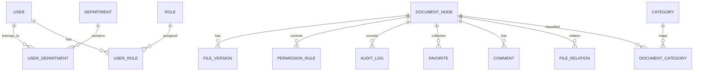

# 数据模型与权限设计

## 1. 核心实体关系



## 2. 基础表

### 2.1 sys_user

| 字段 | 类型 | 说明 |
|---|---|---|
| id | bigint | 主键 |
| username | varchar | 登录账号，唯一 |
| display_name | varchar | 显示名称 |
| password_hash | varchar | 密码哈希 |
| email | varchar | 邮箱 |
| phone | varchar | 手机 |
| avatar_url | varchar | 头像 |
| status | varchar | enabled/disabled |
| last_login_at | datetime | 最近登录时间 |
| created_at | datetime | 创建时间 |
| updated_at | datetime | 更新时间 |

### 2.2 sys_department

| 字段 | 类型 | 说明 |
|---|---|---|
| id | bigint | 主键 |
| parent_id | bigint | 上级部门 |
| name | varchar | 部门名称 |
| code | varchar | 部门编码 |
| sort_order | int | 排序 |
| status | varchar | 状态 |
| created_at | datetime | 创建时间 |
| updated_at | datetime | 更新时间 |

### 2.3 sys_role

| 字段 | 类型 | 说明 |
|---|---|---|
| id | bigint | 主键 |
| parent_id | bigint | 上级角色 |
| name | varchar | 角色名称 |
| code | varchar | 角色编码 |
| description | varchar | 描述 |
| status | varchar | 状态 |
| created_at | datetime | 创建时间 |
| updated_at | datetime | 更新时间 |

### 2.4 sys_user_department

| 字段 | 类型 | 说明 |
|---|---|---|
| user_id | bigint | 用户 ID |
| department_id | bigint | 部门 ID |
| is_primary | boolean | 是否主部门 |

### 2.5 sys_user_role

| 字段 | 类型 | 说明 |
|---|---|---|
| user_id | bigint | 用户 ID |
| role_id | bigint | 角色 ID |

## 3. 文档核心表

### 3.1 doc_node

文件夹和文件统一作为节点管理。

| 字段 | 类型 | 说明 |
|---|---|---|
| id | bigint | 主键 |
| parent_id | bigint | 上级节点 |
| node_type | varchar | folder/file |
| name | varchar | 文件或文件夹名称 |
| full_path | varchar | 完整路径，可冗余加速查询 |
| extension | varchar | 文件扩展名 |
| current_version_id | bigint | 当前版本 ID |
| owner_id | bigint | 所有人 |
| created_by | bigint | 创建人 |
| updated_by | bigint | 更新人 |
| locked_by | bigint | 锁定人 |
| locked_at | datetime | 锁定时间 |
| status | varchar | normal/deleted/archived |
| business_status | varchar | draft/effective/invalid/archived |
| created_at | datetime | 创建时间 |
| updated_at | datetime | 更新时间 |
| deleted_at | datetime | 删除时间 |

关键约束：

- 同一 parent_id 下 name 唯一。
- node_type 为 folder 时不允许存在 file_version。
- 删除采用软删除，便于回收站和审计。

### 3.2 file_version

| 字段 | 类型 | 说明 |
|---|---|---|
| id | bigint | 主键 |
| node_id | bigint | 文件节点 ID |
| version_no | int | 版本号 |
| storage_key | varchar | 文件存储 Key |
| original_filename | varchar | 原始文件名 |
| size_bytes | bigint | 文件大小 |
| md5 | varchar | 文件 MD5 |
| mime_type | varchar | MIME 类型 |
| description | varchar | 版本说明 |
| preview_status | varchar | pending/ready/failed |
| index_status | varchar | pending/ready/failed |
| created_by | bigint | 创建人 |
| created_at | datetime | 创建时间 |

### 3.3 file_preview

| 字段 | 类型 | 说明 |
|---|---|---|
| id | bigint | 主键 |
| version_id | bigint | 文件版本 ID |
| preview_type | varchar | pdf/html/image/text |
| storage_key | varchar | 预览文件 Key |
| status | varchar | pending/ready/failed |
| error_message | text | 错误信息 |
| created_at | datetime | 创建时间 |
| updated_at | datetime | 更新时间 |

## 4. 权限模型

### 4.1 permission_rule

| 字段 | 类型 | 说明 |
|---|---|---|
| id | bigint | 主键 |
| node_id | bigint | 作用文件/文件夹 |
| subject_type | varchar | user/department/role/all |
| subject_id | bigint | 授权对象 ID |
| scope | varchar | self/self_and_files/children/children_and_files/all |
| actions | json | 权限动作数组 |
| effect | varchar | allow/deny |
| priority | int | 优先级 |
| condition_json | json | 高级条件 |
| inherit_enabled | boolean | 是否向下继承 |
| created_by | bigint | 创建人 |
| created_at | datetime | 创建时间 |
| updated_at | datetime | 更新时间 |

### 4.2 权限动作

建议使用字符串枚举，避免旧系统的数字位运算难理解。

```text
visible
folder:create
file:create
file:preview
file:print
file:export_pdf
file:download
file:update
file:delete
file:share_external
permission:manage
full_control
```

### 4.3 权限计算逻辑

1. 获取当前用户 ID、部门 ID 集合、角色 ID 集合。
2. 获取当前节点及祖先节点上的可继承权限规则。
3. 按节点距离、优先级、deny/allow 规则计算。
4. deny 优先级高于 allow。
5. full_control 展开为所有权限动作。
6. 返回当前用户对该节点的最终权限动作集合。

### 4.4 权限校验点

- 列目录：visible。
- 预览：file:preview。
- 下载：file:download。
- 上传新文件：file:create。
- 创建文件夹：folder:create。
- 修改文件：file:update。
- 删除：file:delete。
- 权限配置：permission:manage。
- 外链：file:share_external。

## 5. 分类与属性

### 5.1 category

| 字段 | 类型 | 说明 |
|---|---|---|
| id | bigint | 主键 |
| parent_id | bigint | 上级分类 |
| name | varchar | 分类名称 |
| full_path | varchar | 完整路径 |
| sort_order | int | 排序 |
| status | varchar | 状态 |

### 5.2 document_category

| 字段 | 类型 | 说明 |
|---|---|---|
| node_id | bigint | 文件/文件夹 ID |
| category_id | bigint | 分类 ID |

### 5.3 property_definition

| 字段 | 类型 | 说明 |
|---|---|---|
| id | bigint | 主键 |
| target_type | varchar | file/category |
| name | varchar | 属性名 |
| data_type | varchar | string/number/date/boolean/enum |
| required | boolean | 是否必填 |
| options_json | json | 枚举选项 |

### 5.4 document_property_value

| 字段 | 类型 | 说明 |
|---|---|---|
| node_id | bigint | 文件/文件夹 ID |
| property_id | bigint | 属性定义 ID |
| category_id | bigint | 分类属性时所属分类，可空 |
| value_text | text | 属性值 |

## 6. 协作功能表

### 6.1 favorite

| 字段 | 类型 | 说明 |
|---|---|---|
| id | bigint | 主键 |
| user_id | bigint | 用户 ID |
| node_id | bigint | 文件/文件夹 ID |
| folder_name | varchar | 收藏夹名称 |
| created_at | datetime | 收藏时间 |

### 6.2 message

| 字段 | 类型 | 说明 |
|---|---|---|
| id | bigint | 主键 |
| receiver_id | bigint | 接收人 |
| message_type | varchar | 消息类型 |
| title | varchar | 标题 |
| content | text | 内容 |
| related_node_id | bigint | 关联文件 |
| read_at | datetime | 已读时间 |
| created_at | datetime | 创建时间 |

### 6.3 audit_log

| 字段 | 类型 | 说明 |
|---|---|---|
| id | bigint | 主键 |
| actor_id | bigint | 操作人 |
| action | varchar | 操作类型 |
| target_type | varchar | 目标类型 |
| target_id | bigint | 目标 ID |
| target_path | varchar | 文件路径快照 |
| ip | varchar | IP |
| user_agent | varchar | 浏览器信息 |
| detail_json | json | 操作详情 |
| created_at | datetime | 操作时间 |

## 7. 索引建议

- doc_node(parent_id, name, status)
- doc_node(full_path)
- doc_node(updated_at)
- file_version(node_id, version_no)
- permission_rule(node_id, subject_type, subject_id)
- audit_log(actor_id, created_at)
- audit_log(target_id, created_at)
- message(receiver_id, read_at, created_at)
- favorite(user_id, node_id)
